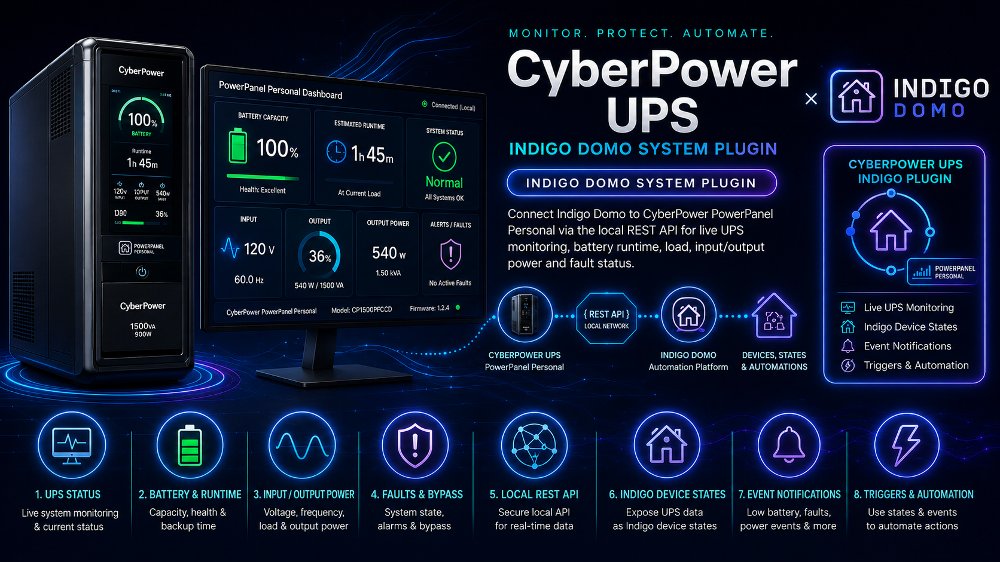
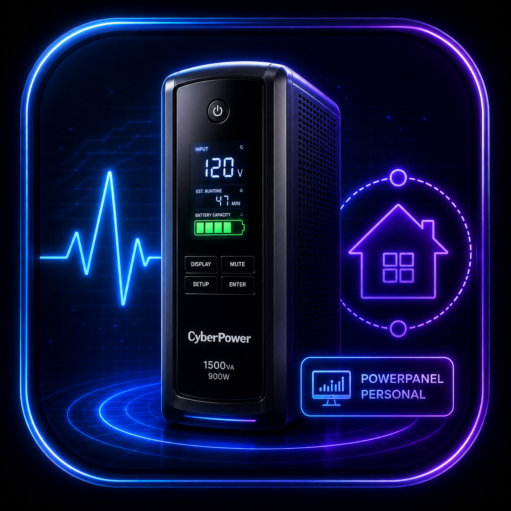

# Cyberpower UPS Panel — Indigo Plugin



Monitor a CyberPower UPS from [Indigo](https://www.indigodomo.com) home automation via the Power Panel Business local REST API. UPS status, battery health, runtime, input/output power, hardware specs, and system warnings are all exposed as Indigo device states and update automatically.

**Developed by GlennNZ**

---

## Contents

1. [What is Power Panel Business?](#1-what-is-power-panel-business)
2. [Installing Power Panel Business](#2-installing-power-panel-business)
3. [Configuring Power Panel Business](#3-configuring-power-panel-business)
4. [Plugin Requirements](#4-plugin-requirements)
5. [Plugin Installation](#5-plugin-installation)
6. [Plugin Configuration](#6-plugin-configuration)
7. [Creating a UPS Device](#7-creating-a-ups-device)
8. [Device States](#8-device-states)
9. [Dynamic State Discovery](#9-dynamic-state-discovery)
10. [Actions](#10-actions)
11. [Menu Items](#11-menu-items)
12. [Automation Examples](#12-automation-examples)
13. [Troubleshooting](#13-troubleshooting)

---

## 1. What is Power Panel Business?

**CyberPower Power Panel Business** is software published by CyberPower Systems that runs on a computer connected to a CyberPower UPS via USB. It provides:

- Real-time UPS monitoring (input voltage, output load, battery capacity, runtime)
- Automatic safe shutdown of the connected computer during a power outage
- A local web interface accessible from any browser on your network
- A REST API — which this plugin uses to pull live data into Indigo

Power Panel Business runs as a background service on macOS, Windows, or Linux. It does **not** require a CyberPower cloud account; everything operates entirely on your local network.

> **Supported UPS models**: Most CyberPower Smart App UPS models with a USB port (CP series, PR series, OR series). Check the CyberPower website for the full compatibility list.

---

## 2. Installing Power Panel Business

### Download

Download Power Panel Business from the CyberPower website:

**CyberPower Systems** → Support → Software → Power Panel Business

Choose the installer for your operating system (macOS, Windows, or Linux). Version 1.4.x and later include the REST API used by this plugin.

### macOS Installation

1. Open the downloaded `.dmg` and run the installer package.
2. Follow the prompts — the installer places a background service (`ppbe`) and the web interface.
3. Connect your UPS to the Mac via USB.
4. Power Panel starts automatically and detects the UPS within a few seconds.

### Linux / NAS Installation

Power Panel Business also runs on Linux, making it suitable for always-on devices like a Synology NAS, Raspberry Pi, or Ubuntu server:

```bash
# Debian/Ubuntu — install the .deb package
sudo dpkg -i powerpanel-xxx.deb

# Start the service
sudo systemctl start pwrstatd
sudo systemctl enable pwrstatd
```

The web interface listens on port **3052** by default.

### Verifying the Installation

Open a browser and navigate to:

```
http://<host-ip>:3052
```

You should see the Power Panel Business web UI showing your UPS model, battery status, and input/output readings. If the page loads, the REST API is available.

> **Tip**: If the UPS is connected to a Mac that also runs Indigo, the host IP is typically `127.0.0.1` or the Mac's LAN IP. If Power Panel runs on a separate device (NAS, Raspberry Pi), use that device's LAN IP.

---

## 3. Configuring Power Panel Business

### Setting a Password

By default Power Panel ships with a default username and password. You should change these before exposing the web UI on your network:

1. Log in to the Power Panel web UI at `http://<host>:3052`
2. Navigate to **Settings → Account** (or **Administration → Account**)
3. Set a strong password and note it — you will enter it in the Indigo device config

### Finding the REST API Port

The default REST API port is **3052**. You can confirm it in Power Panel under **Settings → System** or by checking the URL in your browser when logged in.

### Firewall / Network Access

Ensure the Mac running Indigo can reach the Power Panel host on port 3052:

```bash
# Quick test from the Indigo Mac terminal
curl -s http://<host-ip>:3052/local/rest/v1/ups/status
# Should return JSON (a 401 is expected before login — that confirms connectivity)
```

If this hangs or is refused, check:
- The firewall on the Power Panel host allows inbound TCP 3052
- Both devices are on the same VLAN/subnet, or routing is in place

### Power Panel on the Same Mac as Indigo

If Power Panel runs on the same Mac as Indigo Server, use `127.0.0.1` as the host. No firewall changes are needed.

---

## 4. Plugin Requirements

| Requirement | Detail |
|-------------|--------|
| Indigo version | 2025.1 or later (ServerApiVersion 3.0) |
| Python | 3.10+ (included with Indigo 2023.2+) |
| Power Panel Business | 1.4.x or later, running locally |
| Network | Indigo Mac must reach Power Panel host on port 3052 |
| UPS connection | USB cable from UPS to the Power Panel host |

---

## 5. Plugin Installation

### Double click the downloaded plugin Bundle to install

---

## 6. Plugin Configuration

Open **Plugins → Cyberpower UPS Panel → Configure…** to set global options.

| Field | Default | Description |
|-------|---------|-------------|
| Poll Interval | 60 | Seconds between status polls across all UPS devices. Minimum 10. |
| Show Debug Logging | off | Logs raw API responses and all state values. Enable only when diagnosing issues. |

> Credentials (host, port, username, password) are configured **per device**, not here. This allows the plugin to monitor multiple UPS units on different hosts.

---

## 7. Creating a UPS Device

1. In Indigo, open **Devices → New Device**
2. Set **Type** to **Cyberpower UPS Panel**
3. Set **Model** to **CyberPower UPS**
4. Give it a descriptive name, e.g. `Office UPS` or `Server Room UPS`
5. Click **Edit Device Settings…** and fill in:

| Field | Example | Notes |
|-------|---------|-------|
| Host Address | `192.168.1.209` | IP of the Power Panel host |
| Port | `3052` | Default Power Panel REST port |
| Username | `admin` | As set in Power Panel Account settings |
| Password | `yourpassword` | Plain text — sent directly to the API |

6. Click **Save** — the plugin connects immediately, authenticates, and populates all states on the first poll

The device icon turns **green** when the system state is Normal, and **amber** if any system fault is reported.

### Multiple UPS Units

Create one Indigo device per UPS. Each device has its own host/port/credentials and maintains an independent authentication token. The global poll interval applies to all devices.

---

## 8. Device States

States appear in the Indigo device detail panel and are available for triggers, conditions, and control pages. States are **dynamically discovered** — see [section 9](#9-dynamic-state-discovery) for details.

Each poll cycle queries three API endpoints in sequence: `/ups/status`, `/ups/spec`, and `/ups/summary`.

### Always-Present States (defined in Devices.xml)

| State | Type | Description |
|-------|------|-------------|
| `communicationStatus` | Boolean | `true` = UPS communication available |
| `systemStateText` | String | Overall system status, e.g. `Normal` |
| `lastUpdate` | String | Timestamp of last successful poll |

### Input (mains power in)

| State | Type | Example |
|-------|------|---------|
| `inputAvailable` | Boolean | `true` |
| `inputState` | Number | `0` = Normal |
| `inputStateText` | String | `Normal` |
| `inputVoltage` | Number | `243.5` (V) |
| `inputFrequency` | Number | `50.00` (Hz) |
| `inputCurrent` | Number | Current draw (A) — appears when reported |
| `inputPowerFactor` | Number | Appears when reported |

### Output (power delivered to equipment)

| State | Type | Example |
|-------|------|---------|
| `outputAvailable` | Boolean | `true` |
| `outputState` | Number | `0` = Normal |
| `outputStateText` | String | `Normal` |
| `outputVoltage` | Number | `230.0` (V) |
| `outputCurrent` | Number | `4.3` (A) |
| `outputFrequency` | Number | `50.00` (Hz) |
| `outputLoadPercent` | Number | `34` (%) |
| `outputWatts` | Number | `790` (W) |
| `outputVA` | Number | `1025` (VA) |
| `outputNcl1StateText` | String | `On` — outlet bank 1 state |
| `outputActivePower` | Number | Appears when reported |
| `outputReactivePower` | Number | Appears when reported |

### Battery

| State | Type | Example |
|-------|------|---------|
| `batteryAvailable` | Boolean | `true` |
| `batteryState` | Number | `0` = Normal |
| `batteryStateText` | String | `Normal, Fully Charged` |
| `batteryVoltage` | Number | `82.2` (V) |
| `batteryCapacityPercent` | Number | `100` (%) |
| `batteryRemainingRunTimeSecs` | Number | `900` |
| `batteryRemainingRunTimeFormatted` | String | `0hr. 15min.` |
| `batteryRuntimeInsufficient` | Boolean | `false` |
| `batteryHealthIndex` | Number | `94` — BHI 0–100 |
| `batteryModularRuntimeZero` | Boolean | `false` |
| `batteryChargeTimeSecs` | Number | Appears while charging |
| `batteryChargeTimeFormatted` | String | Appears while charging |
| `batteryTemperatureCelsius` | Number | Appears on models with temp sensor |
| `batteryHighVoltage` | Number | Appears when threshold configured |
| `batteryLowVoltage` | Number | Appears when threshold configured |

### Bypass

| State | Type | Example |
|-------|------|---------|
| `bypassAvailable` | Boolean | `false` on most models |
| `bypassState` | Number | Appears when bypass active |
| `bypassStateText` | String | Appears when bypass active |
| `bypassVoltage` | Number | Appears when bypass active |
| `bypassFrequency` | Number | Appears when bypass active |

### System

| State | Type | Example |
|-------|------|---------|
| `systemAvailable` | Boolean | `true` |
| `systemState` | Number | `0` = Normal |
| `systemStateText` | String | `Normal` |
| `systemHardwareFaultAvailable` | Boolean | `true` |
| `systemHardwareFaultCode` | String | `0x80808080808080` |
| `systemTemperatureCelsius` | Number | Appears on models with ambient sensor |
| `systemTemperatureFormatted` | String | Formatted temperature string |

### Hardware Spec

Populated from `/ups/spec` on every poll. These values reflect the physical UPS hardware and rating data.

| State | Type | Example |
|-------|------|---------|
| `specUpsModel` | String | `OLS3000ERT2UA` |
| `specSerialNo` | String | `310049ET30000025` |
| `specUpsType` | String | `On-Line` |
| `specRatingPower` | String | `3000 VA / 2700 W` |
| `specRatingVolt` | String | `208~240 V` |
| `specRatingFreq` | String | `40~70 Hz` |
| `specMaxCurrent` | String | `13.0 Amp` |
| `specHardwareVersion` | String | `OS02RV14` |
| `specUsbVersion` | String | `v.01` |
| `specDeviceName` | String | Name given to this UPS in Power Panel |
| `specLocation` | String | Location field from Power Panel settings |
| `specContact` | String | Contact field from Power Panel settings |
| `specBatteryReplacedDate` | String | `2025/11/03` |
| `specNextReplacementDate` | String | `2029/05/03` |
| `specAloneOutletNumber` | Number | `1` — number of individually switched outlets |
| `specExternalBatteryCabinets` | Number | `0` |
| `specIsExpired` | Boolean | `false` — warranty/replacement expired |
| `specIsThreePhase` | Boolean | `false` |
| `specEbmSupported` | Boolean | `false` — external battery module |
| `specIndividualBankControl` | Boolean | `false` — per-outlet switching capability |

### System Summary

Populated from `/ups/summary` on every poll. Useful for triggering on warning conditions.

| State | Type | Example |
|-------|------|---------|
| `summaryNormalMessage` | String | `The UPS is working normally.` |
| `summaryWarningMessage` | String | Empty when healthy; populated with warning text when a fault is present |
| `summaryHasWarning` | Boolean | `false` — `true` when any warning message is active |

---

## 9. Dynamic State Discovery

States are **not** pre-defined in a static list. The plugin uses Indigo's `getDeviceStateList()` callback to register states at runtime:

1. The device starts with three anchor states (`communicationStatus`, `systemStateText`, `lastUpdate`)
2. On the first successful poll, the plugin extracts every non-null field from all three API endpoints
3. Any key not yet registered is added to `pluginProps['discoveredStates']` and `stateListOrDisplayStateIdChanged()` is called — Indigo re-invokes `getDeviceStateList()` which now includes the new states
4. On subsequent polls the states are already registered and written directly

**Consequences of this design:**

- States whose API values are currently `null` do not appear until the UPS actually reports a value. For example, `batteryTemperatureCelsius` will not exist until the UPS hardware reports a temperature reading.
- Discovered states survive plugin restarts — they are persisted in `pluginProps` and rebuilt immediately on `deviceStartComm`.
- If you upgrade the plugin and new fields are added, those states appear automatically on the next poll without deleting and recreating the device.
- **If you see fewer states than expected**, use **Plugins → Cyberpower UPS Panel → Force UPS Status Update** to trigger an immediate poll and check the Indigo Event Log with debug logging enabled.

---

## 10. Actions

Actions are available under **Actions → Cyberpower UPS Panel** when building action groups or triggers.

### Alarm Test

Triggers the UPS audible alarm test. The UPS will sound briefly to confirm the alarm is functional. Useful for periodic scheduled tests or verifying the alarm after installation.

- Select the target UPS device from the device list
- No additional configuration required

---

## 11. Menu Items

Access these from **Plugins → Cyberpower UPS Panel** in the Indigo menu bar:

| Item | Action |
|------|--------|
| Force UPS Status Update | Clears all cached tokens and polls all UPS devices immediately |
| Toggle Debugging | Enables or disables verbose debug logging at runtime (no plugin restart needed) |

---

## 12. Automation Examples

### Trigger on Battery Not Fully Charged

- **Trigger**: Device state `batteryStateText` changes and is not equal to `Normal, Fully Charged`
- **Action**: Send a notification or log the event

### Trigger on Low Runtime

- **Trigger**: Device state `batteryRemainingRunTimeSecs` falls below `300` (5 minutes)
- **Action**: Begin graceful shutdown of servers, send alert

### Trigger on Load Spike

- **Trigger**: Device state `outputLoadPercent` rises above `80`
- **Action**: Send a Pushover notification with the current wattage

### Trigger on UPS Going to Battery

- **Trigger**: Device state `inputStateText` changes to anything other than `Normal`
- **Action**: Start a countdown timer, notify household, log timestamp

### Trigger on System Warning

- **Trigger**: Device state `summaryHasWarning` becomes `true`
- **Action**: Send an alert with the value of `summaryWarningMessage`

### Scheduled Alarm Test

- **Schedule**: Weekly, at a convenient time
- **Action**: Run the **Alarm Test** action on the UPS device

### Control Page Display

Add these states to an Indigo control page for a live UPS dashboard:

- `batteryCapacityPercent` — battery level
- `batteryRemainingRunTimeFormatted` — time remaining
- `outputLoadPercent` — current load
- `outputWatts` — watts being drawn
- `systemStateText` — overall health
- `inputVoltage` / `outputVoltage` — power quality
- `summaryWarningMessage` — active warnings

---

## 13. Troubleshooting

### Plugin enables but device shows "Connection failed"

1. Confirm Power Panel is running: open `http://<host>:3052` in a browser
2. Test the API directly from the Indigo Mac terminal:
   ```bash
   curl -s http://<host>:3052/local/rest/v1/ups/status
   ```
   A `401 Unauthorized` response confirms the API is reachable (authentication is just required)
3. Enable **Show Debug Logging** and check the Indigo Event Log — the plugin logs the exact URL and error

### Authentication fails (401)

- Verify the username and password match what is set in the Power Panel web UI under **Account Settings**
- The plugin sends the password as plain text over the local network — no hashing is applied
- Try logging in at `http://<host>:3052` directly with the same credentials to confirm they work

### Repeated 403 errors after UPS restart or Power Panel upgrade

- The plugin automatically re-authenticates on 403 (drops the stale token and logs in fresh)
- If it persists: use **Force UPS Status Update** from the Plugins menu, or disable and re-enable the plugin

### Timeout errors

- The plugin logs a clean timeout message (no stack trace) and drops the token
- On the next poll it will re-authenticate automatically
- If timeouts are frequent, increase the poll interval in Plugin Preferences

### Fewer states than expected

- States only appear when the API returns a non-null value for them
- Enable debug logging — the raw API JSON and the full list of states being written are logged on every poll
- Use **Force UPS Status Update** to trigger an immediate poll and inspect the log

### States stopped updating after Power Panel upgrade

- Power Panel upgrades can invalidate the existing session token, causing 401/403
- The plugin handles this automatically; if not, disable/re-enable the plugin

### Plugin not visible in Manage Plugins

- Verify the bundle name ends with `.indigoPlugin`
- Check it is in the correct folder:
  `~/Library/Application Support/Perceptive Automation/Indigo 2025.2/Plugins/`
  or the `Plugins (Disabled)/` folder if not yet enabled
- Check the Indigo Event Log for any Python errors on load

---

## Version History

| Version | Date | Notes |
|---------|------|-------|
| 1.1.1 | 2026-05-31 | Alarm test action; `/ups/spec` and `/ups/summary` endpoints added; spec and summary states |
| 1.0.6 | 2026-05-30 | Explicit TimeoutError handling; 403 treated as stale token → re-auth; recursion guard |
| 1.0.5 | 2026-05-30 | Truly dynamic states via `getDeviceStateList()` override; Devices.xml reduced to 3 anchor states |
| 1.0.4 | 2026-05-30 | Comprehensive `_build_states()` covering all API fields; null-skipping |
| 1.0.3 | 2026-05-30 | Debug logging of raw API response and state list |
| 1.0.2 | 2026-05-30 | Fixed double-Bearer auth bug; plain text password; logging restored |
| 1.0.1 | 2026-05-30 | Credentials moved to device level; per-device token cache; dynamic state refresh |
| 1.0.0 | 2026-05-30 | Initial release |
